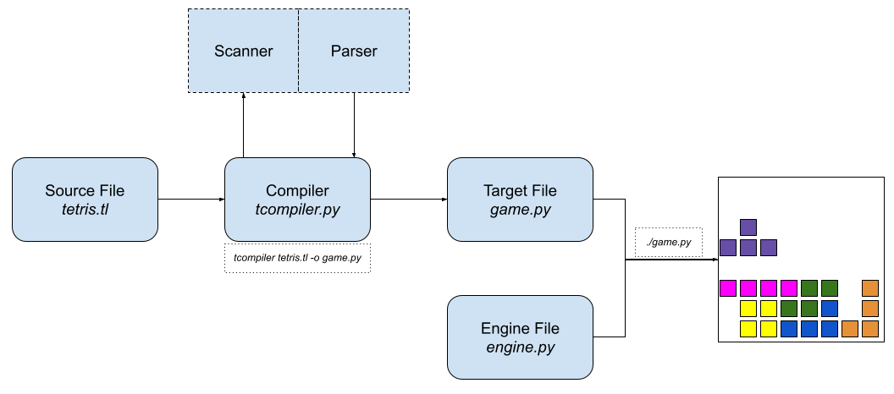

# CS F363 Compiler Construction

<p align="center">

| G17           | Blockbusters          |
| ------------- | --------------------- |
| 2019A7PS0076G | Hardik Shah           |
| 2019A7PS0091G | Abhineet Karn         |
| 2019A7PS0136G | Aryan Tyagi           |
| 2019A7PS0167G | Abhinav Srivastava    |
| 2019A7PS0178G | Hitarth Kothari       |
| 2019A7PS0179G | Hrishikesh Kusneniwar |

</p>

```
     ________  ___       ________  ________  ___  __                        
    |\   __  \|\  \     |\   __  \|\   ____\|\  \|\  \                      
    \ \  \|\ /\ \  \    \ \  \|\  \ \  \___|\ \  \/  /|_                    
     \ \   __  \ \  \    \ \  \\\  \ \  \    \ \   ___  \                   
      \ \  \|\  \ \  \____\ \  \\\  \ \  \____\ \  \\ \  \                  
       \ \_______\ \_______\ \_______\ \_______\ \__\\ \__\                 
        \|_______|\|_______|\|_______|\|_______|\|__| \|__|                 
 ________  ___  ___  ________  _________  _______   ________  ________      
|\   __  \|\  \|\  \|\   ____\|\___   ___\\  ___ \ |\   __  \|\   ____\     
\ \  \|\ /\ \  \\\  \ \  \___|\|___ \  \_\ \   __/|\ \  \|\  \ \  \___|_    
 \ \   __  \ \  \\\  \ \_____  \   \ \  \ \ \  \_|/_\ \   _  _\ \_____  \   
  \ \  \|\  \ \  \\\  \|____|\  \   \ \  \ \ \  \_|\ \ \  \\  \\|____|\  \  
   \ \_______\ \_______\____\_\  \   \ \__\ \ \_______\ \__\\ _\ ____\_\  \ 
    \|_______|\|_______|\_________\   \|__|  \|_______|\|__|\|__|\_________\
                       \|_________|                             \|_________|
```

<br>

## Top Level Design Specs

### Overall Program Structure

#### ???

python

### Primitives

- Booleans
- Integers
- Strings
- Lists
- Functions

### Programmable Features

- Define the shape and size of the grid
- Change the shape of the blocks
- Define a custom colour palette and use it to colour blocks and other stuff
- Change the speed and acceleration of falling blocks
- Change what happens when input is received
- 

### Pipeline Schema




## Scanner Design


## Parser Design

//

Lexical analyzer reads the stream of characters making up the source program and groups the characters into meaningful sequences called lexemes. For each lexeme, the lexical analyzer produces as output a token of the form `<token-name, attribute-value>`. 


// ASSUMPTIONS

1. Case-insensitive
1. 


// LANGUAGE FEATURES

1. commands end with ;
1. 


